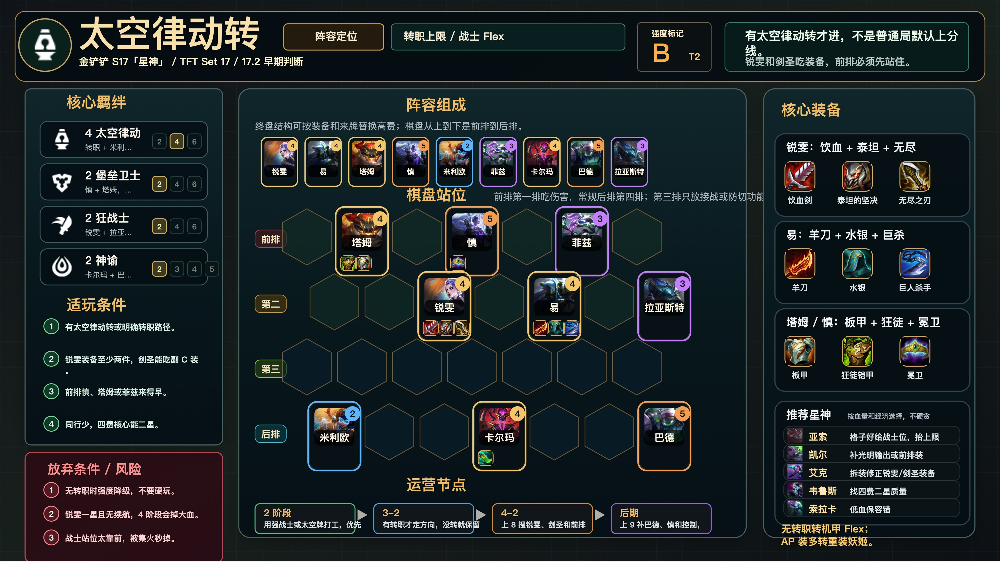

# 太空律动转

适用版本：金铲铲 S17「星神」/ TFT Set 17 / 17.2 早期判断
阵容定位：转职上限阵，T2 条件阵容。



## 阵容组成

9 人口：锐雯、易、塔姆、慎、米利欧、菲兹、卡尔玛、巴德、拉亚斯特。

核心羁绊：太空律动、堡垒卫士、狂战士、神谕。

```text
前排 | . 塔姆 . 慎 . 菲兹 .
第二 | . . 锐雯 . 易 . 拉亚斯特
第三 | . . . . . . .
后排 | 米利欧 . . 卡尔玛 . . 巴德
```

## 适玩条件

- 有太空律动转或明确转职路径。
- 锐雯装备至少两件，易能吃副 C 装。
- 前排慎、塔姆或菲兹来得早。
- 四费核心同行少，4-2 能搜到二星。

## 放弃条件

- 无转职时不要硬玩。
- 锐雯一星且无续航，4 阶段容易掉大血。
- 战士站位过前，被集火秒掉。

## 装备

- 锐雯：饮血剑、泰坦的坚决、无尽之刃。
- 易：鬼索的狂暴之刃、水银、巨人杀手。
- 塔姆 / 慎：石像鬼石板甲、狂徒铠甲、冕卫。

## 运营节奏

- 2 阶段：用强战士或太空牌打工，优先保血。
- 3-2：有转职才定方向，没转就保留 Flex。
- 4-2：上 8 搜锐雯、易和前排二星。
- 后期：上 9 补巴德、慎和控制，别硬追三星。

## 注意事项

- 锐雯和易站第二排接战，不要第一排被秒。
- 后排功能位分散，避免同吃范围控制。
- 没转职直接降级为四费拼，不要硬凑。
