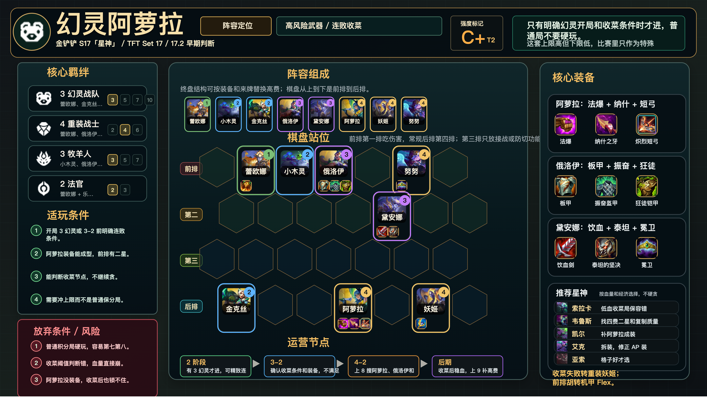

# 幻灵阿萝拉

适用版本：金铲铲 S17「星神」/ TFT Set 17 / 17.2 早期判断
阵容定位：高风险武器，连败收菜局。



## 阵容组成

8 人口：蕾欧娜、小木灵、金克丝、俄洛伊、黛安娜、阿萝拉、乐芙兰、努努和威朗普。

核心羁绊：幻灵战队、重装战士、牧羊人、法官。

```text
前排 | . 蕾欧娜 小木灵 俄洛伊 . 努努 .
第二 | . . . . 黛安娜 . .
第三 | . . . . . . .
后排 | 金克丝 . . 阿萝拉 . 乐芙兰 .
```

## 适玩条件

- 开局 3 幻灵或 3-2 前明确连败条件。
- 阿萝拉装备能成型，前排有二星。
- 能判断收菜节点，不继续贪。
- 需要冲上限，而不是普通保分局。

## 放弃条件

- 普通积分局不要硬玩，容易第七第八。
- 收菜阈值判断错，血量直接崩。
- 阿萝拉没装备，收菜后也锁不住。

## 装备

- 阿萝拉：珠光护手、纳什之牙、炽烈短弓。
- 俄洛伊：石像鬼石板甲、振奋盔甲、狂徒铠甲。
- 黛安娜：饮血剑、泰坦的坚决、冕卫。

## 运营节奏

- 2 阶段：有 3 幻灵才进，可精致连败。
- 3-2：确认收菜条件和装备，不满足转阵。
- 4-2：上 8 搜阿萝拉、俄洛伊和前排质量。
- 后期：收菜后稳血，上 9 补高费控制。

## 注意事项

- 这套是比赛里的高风险武器，不是默认主线。
- 低血时先锁前四，不要继续贪层数。
- 阿萝拉和乐芙兰分侧，避免同吃控制。
