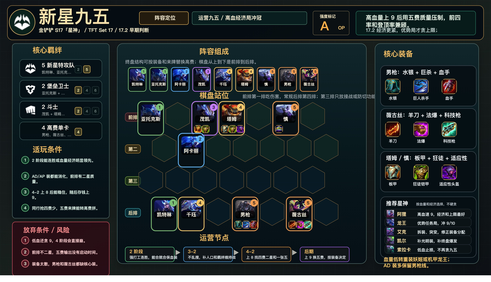

# 新星九五

适用版本：金铲铲 S17「星神」/ TFT Set 17 / 17.2 早期判断
阵容定位：运营九五，高血量经济局冲冠军。



## 数据摘要

当前 17.2 大数据仍在早期阶段，`tactics.tools`、`datatft.com`、`tftacademy.com` 还需要继续复核。比赛中先按“高血高经济时的 OP 运营线”处理，不编造平均排名、前四率和登顶率。

## 阵容组成

9 人口：凯特琳、亚托克斯、阿卡丽、茂凯、千珏、塔姆、慎、格雷福斯、薇古丝。

核心羁绊：5 新星特攻队、2 堡垒卫士、2 斗士。不要把这套和机甲龙王混写；机甲是另一条 OP 分支。

```text
前排 | 亚托克斯 . 茂凯 塔姆 . 慎 .
第二 | . 阿卡丽 . . . . .
第三 | . . . . . . .
后排 | 凯特琳 千珏 . 格雷福斯 . 薇古丝 .
```

## 适玩条件

- 2 阶段能连胜或血量、经济明显领先。
- AD/AP 装都能消化，前排有二星质量。
- 4-2 上 8 后能稳住，随后有钱上 9。
- 同行抢高费少，五费来牌能自然转换。

## 放弃条件

- 低血还想贪 9。
- 前排不二星，五费输出没有启动时间。
- 装备太散，格雷福斯和薇古丝都缺核心装。
- 4-2 搜完仍不能锁血，应该转重装妖姬或机甲龙王。

## 装备

- 格雷福斯：水银、巨人杀手、斯特拉克的挑战护手。
- 薇古丝：鬼索的狂暴之刃、珠光护手、海克斯科技枪刃。
- 塔姆 / 慎：石像鬼石板甲、狂徒铠甲、适应性头盔、冕卫、日炎斗篷。

## 运营节奏

- 2 阶段：强打工连胜，能合就合保血装。
- 3-2：不乱搜，补人口和羁绊维持战力。
- 4-2：上 8 找四费二星和一张五费锁血。
- 后期：上 9 换五费，按装备决定格雷福斯或薇古丝主 C。

## 星神选择

- 阿狸：高血经济局速 9。
- 奥瑞利安·索尔：优势任务局冲 9/10 上限。
- 艾克：拆装、突变，修正装备分配。
- 凯尔：补光明装，补终盘爆发。
- 索拉卡：低血止损，不再贪九五。

## 注意事项

- 男枪和薇古丝分侧站，避免同吃范围控制。
- 慎和塔姆顶主 C 对侧，给后排争取启动时间。
- 8 级质量不够时先保前四，不硬攒 9。
