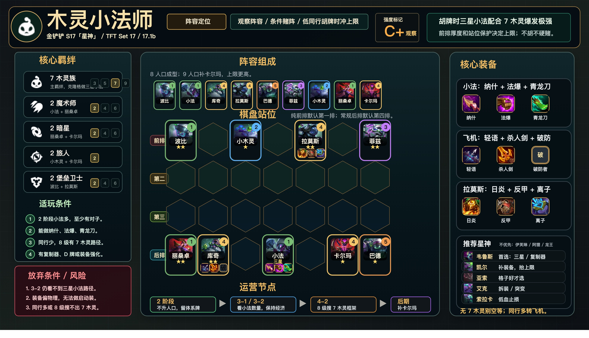

# 木灵小法师

更新时间：2026-04-28

适用版本：金铲铲 S17「星神」/ TFT Set 17，17.1b 数据作参考。

## 阵容图卡



高清 JPEG：`assets/comps/full/woodland-veigar-17.1b.jpg`，当前输出尺寸为 `3000 x 1725`。

这张图卡对应你今天实战吃鸡的游侠手游一图流分支，不是上一版记录的锐雯游侠分支。

核心羁绊是：

- `7 木灵族`
- `2 魔术师`
- `2 暗星`
- `2 旅人`
- `2 堡垒卫士`

## 阵容定位

木灵小法是条件型运营阵容，不是单纯 5 级硬赌。核心思路是前期保血升人口，8 人口搜出 7 木灵族，用木灵克隆格做三星小法；后期 9 人口补卡尔玛，打开完整的 `2 暗星 + 2 旅人`。

这套阵容公开大数据仍然不能支持无脑强玩，但你已经用这一套吃鸡，说明它在开局小法多、装备对、同行少时有冲第一能力。比赛里把它当作“胡牌可冲鸡”的观察阵容，而不是默认主线。

## 数据摘要

| 来源 | 版本/范围 | 平均排名 | 前四率 | 登顶率 | 登场率/样本 | 结论 |
| --- | --- | --- | --- | --- | --- | --- |
| 游侠手游木灵小法一图流 | 2026-04-16 / S17 | TBD | TBD | TBD | 攻略页 | 给出本分支阵容、羁绊、装备和运营 |
| tactics.tools 小法单位页 | 17.1b / 高分段页面片段 | 4.51 | 48.0% | 14.5% | 约 11k 场，登场率 0.27 | 小法不是稳定主流，但有登顶能力 |
| MetaBot 小法单位页 | Set 17，2026-04-16 更新 | 5.00 | 40.2% | 7.4% | 194,416 场，登场率 5.3% | 单位整体偏弱，必须满足条件 |
| 个人样本 | 2026-04-28 中午 | 1.00 | 100% | 100% | 1 场 | 已吃鸡，但样本量不足 |

## 阵容组成

### 8 人口核心

先做 `7 木灵族 + 丽桑卓`：

| 职责 | 棋子 |
| --- | --- |
| 主 C | 小法 / 维迦 |
| 副 C | 库奇 |
| 主坦 | 拉莫斯 |
| 前排 / 体系 | 波比、菲兹、小木灵 |
| 后排 / 功能 | 巴德、丽桑卓 |

### 9 人口大成

补 `卡尔玛`，完整变成：

| 棋子 | 作用 |
| --- | --- |
| 波比 | 木灵族、堡垒卫士，前排 |
| 小法 / 维迦 | 木灵族、魔术师，主 C |
| 菲兹 | 木灵族，前排扰乱 |
| 库奇 | 木灵族，副 C |
| 拉莫斯 | 木灵族、堡垒卫士，主坦 |
| 巴德 | 木灵族，高费功能牌 |
| 小木灵 | 木灵族、旅人，补旅人 |
| 丽桑卓 | 暗星、魔术师，补魔术师和暗星 |
| 卡尔玛 | 暗星、旅人，9 人口补完整羁绊 |

## 装备

### 小法 / 维迦

优先按游侠手游一图流：

- 纳什之牙
- 珠光护手
- 朔极之矛

备选：

- 蓝霸符：没有青龙刀时可用。
- 灭世者的死亡之帽：缺爆发时使用。
- 海克斯科技枪刃：需要续航时使用。
- 虚空之杖：对手魔抗高时使用。

### 库奇

优先：

- 最后的轻语
- 死亡之刃
- 破防者

注：当前 `data/s17/items.zh.json` 暂未抓到 `破防者` 图标，一图流里用文字占位，避免用错误装备图标替代。

### 拉莫斯

优先：

- 日炎斗篷
- 棘刺背心
- 离子火花

如果装备不完全，拉莫斯也可以吃石像鬼石板甲、狂徒铠甲、适应性头盔、冕卫等通用肉装。

## 站位示意

纯前排和召唤前排默认放第一排，常规后排放最后一排；第二排/第三排只放需要拉扯、防切或补控制的功能位。

```text
前排 | 波比 .    小木灵 .    拉莫斯 .    菲兹
第二 | .    .    .    .    .    .    .
第三 | .    .    .    .    .    .    .
后排 | 丽桑卓 库奇 .    小法  .    卡尔玛 巴德
```

站位逻辑：

- 拉莫斯和小木灵都放第一排吃第一波伤害，波比和菲兹分摊前排压力。
- 小法放后排中间偏安全位，不固定角落，避免被切入或钩子直接处理。
- 库奇、卡尔玛和巴德站第四排，拉开范围伤害，也能保护小法。
- 决赛圈如果对手有强切后排，小法向中间收，低价值后排吃第一波切入。

## 适玩条件

满足越多越适合玩：

- 开局小法特别多，或者 2 阶段自然来小法对子。
- 有宝宝学院、微型妮蔻、复制器、D 牌或快速三星类强化。
- 能做纳什、法爆、青龙刀这类小法启动装。
- 木灵牌来得自然，8 级有机会搜出 7 木灵。
- 同行少，没有多人卡小法、库奇、拉莫斯和巴德。

## 放弃条件

出现以下情况应转阵：

- 2 阶段小法数量少，且没有木灵体系牌。
- 4-2 上 8 后搜不出 7 木灵框架，血量又低。
- 小法装备做不出来，装备明显偏物理。
- 同行多，尤其有人同样走木灵小法或木灵飞机。
- 拉莫斯和库奇不能二星，前排和副 C 质量不够锁血。

可转方向：

- 木灵飞机：木灵牌多但小法三星慢，转库奇主 C。
- 重装妖姬：法系装备多但木灵断档，转 AP 四费体系。
- 机甲 Flex：肉装和输出装都杂，8 级需要马上锁血。

## 运营思路

### 前期

- 开局小法多、有韦鲁斯局能连胜，或者拿到宝宝学院时优先考虑。
- 前期用木灵搭配牧羊人过渡，优先保血和经济。
- 不要在 2 阶段乱搜，除非小法数量已经特别离谱且能马上提质量。

### 中期

- 核心节奏不是 5 级硬赌，而是升人口后在 8 级搜 7 木灵。
- 8 人口搜出 7 木灵后，用木灵格子做三星小法。
- 先保证拉莫斯和库奇两星，否则小法三星也可能前排扛不住。

### 后期

- 小法三星后继续补阵容质量，不要停在低人口。
- 9 人口补卡尔玛，完整开 `2 暗星 + 2 旅人`。
- 决赛圈根据对手主 C 和切入位调整小法、库奇和巴德的位置。

## 星神和强化偏好

星神选择结论：`韦鲁斯 > 凯尔 > 亚索 / 艾克 > 索拉卡止损`。

| 优先级 | 星神 | 适合原因 | 怎么执行 |
| --- | --- | --- | --- |
| 1 | 韦鲁斯 | 最适合追三星、复制器和高总星级质量。木灵小法需要小法三星，同时也需要拉莫斯、库奇二星锁血。 | 开局小法多、木灵牌顺、同行少时优先选。拿到复制器或商店类奖励时，优先解决小法三星和 4 费前排 / 副 C 二星。 |
| 2 | 凯尔 | 装备质量直接决定小法和拉莫斯上限，光明成装能显著提高决赛圈强度。 | 小法装备缺 1 件，或拉莫斯肉装不完整时优先。装备已经给错人且没有拆卸器时，凯尔收益要打折。 |
| 3 | 亚索 | 格子能放大小法输出、拉莫斯坦度或库奇副 C 质量。 | 只有格子位置适合主 C / 主坦时才优先；如果格子逼小法站危险角落，不要硬吃。 |
| 3 | 艾克 | 异常突变和拆卸器适合多核心装备调整，能把资源重新分给小法、拉莫斯或库奇。 | 装备散、临时打工装多、需要重新分装时选。没有明确承接突变的核心时，收益不如韦鲁斯和凯尔稳定。 |
| 5 | 索拉卡 | 低血量止损，能提高容错和前四率。 | 4 阶段血量低、目标从吃鸡降为先进前四时选。高血量优势局不要优先选。 |

不优先：

- 伊芙琳：木灵小法中期没成型时容易掉血，额外掉 1 血会放大风险。
- 阿狸 / 奥瑞利安·索尔：更偏速 8、速 9、九五或高费拼多多。除非你血量经济很好，并且已经准备从木灵小法转高费运营，否则不如韦鲁斯、凯尔直接。
- 锤石：资源随机性高，适合高熟练度 flex，但比赛里不如韦鲁斯和凯尔稳定。

强化偏好：

- 微型妮蔻、复制器、快速三星类奖励。
- 宝宝学院。
- 装备补充，尤其能补小法三件套或拉莫斯肉装。
- D 牌 / 商店 / 经济类强化，但前提是不牺牲 3、4 阶段血量。

血量低时，不要继续贪经济，优先拿即时战力和前排坦度。

## 比赛使用判断

当前评级：观察阵容，开局胡才玩。

比赛里按这个标准执行：

- 普通积分局：只在小法、木灵牌和装备同时顺时玩。
- 优势局：如果 8 级搜出 7 木灵，小法三星早，可以当冲第一阵容。
- 劣势局：不要硬赌三星小法，优先转木灵飞机或 AP 运营止损。

## 后续验证清单

接下来每玩一局记录：

- 2-1 小法数量
- 4-2 等级、金币、血量
- 8 级是否搜出 7 木灵
- 小法三星完成回合
- 库奇和拉莫斯是否二星
- 同行数量
- 最终名次
- 输给什么阵容

如果后续 5 局内能做到前四 3 局以上、登顶 1 局以上，再考虑把它从观察阵容提升为比赛备选阵容。

## 来源

- 游侠手游木灵小法一图流：`https://m.ali213.net/news/gl2604/1764317.html`
- tactics.tools 小法单位页：`https://tactics.tools/units/veigar/top`
- tactics.tools 小法资料页：`https://tactics.tools/info/units/veigar`
- MetaBot 小法单位页：`https://metabot.gg/en/TFT/unit/TFT17_Veigar/overview`
