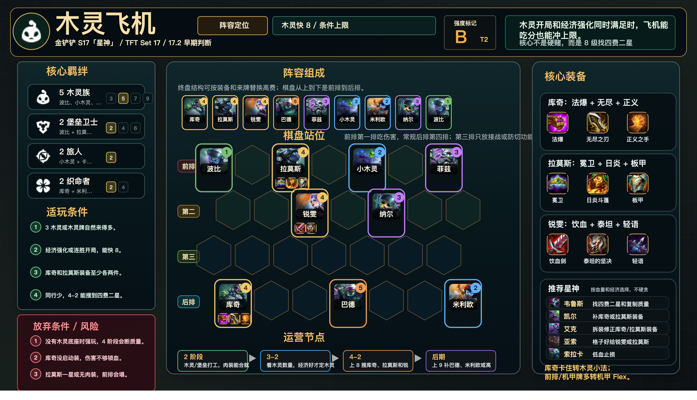

# 木灵飞机

适用版本：金铲铲 S17「星神」/ TFT Set 17 / 17.2 早期判断
阵容定位：木灵快 8，T2 条件上限阵容。



## 阵容组成

9 人口：库奇、拉莫斯、锐雯、巴德、菲兹、小木灵、米利欧、纳尔、波比。

核心羁绊：木灵族、堡垒卫士、旅人、织命者。

```text
前排 | 波比 . 拉莫斯 . 小木灵 . 菲兹
第二 | . . 锐雯 . 纳尔 . .
第三 | . . . . . . .
后排 | 库奇 . . 巴德 . . 米利欧
```

## 适玩条件

- 3 木灵或木灵牌自然来得多。
- 有经济强化或连胜开局，能按快 8 节奏打。
- 库奇和拉莫斯装备至少各两件。
- 同行少，4-2 能搜到四费二星。

## 放弃条件

- 没有木灵底座时不要强玩。
- 库奇没启动装，伤害不够锁血。
- 拉莫斯一星或无肉装，前排会塌。

## 装备

- 库奇：珠光护手、无尽之刃、正义之手。
- 拉莫斯：冕卫、日炎斗篷、石像鬼石板甲。
- 锐雯：饮血剑、泰坦的坚决、最后的轻语。

## 运营节奏

- 2 阶段：木灵 / 堡垒打工，肉装能合就合。
- 3-2：看木灵数量和经济，经济好才定木灵飞机。
- 4-2：上 8 搜库奇、拉莫斯和锐雯质量。
- 后期：上 9 补巴德、米利欧或高费控制。

## 注意事项

- 拉莫斯和小木灵默认第一排，保证后排启动。
- 库奇放第四排安全位，不固定死角。
- 木灵牌多但库奇慢，可以转木灵小法或机甲 Flex。
