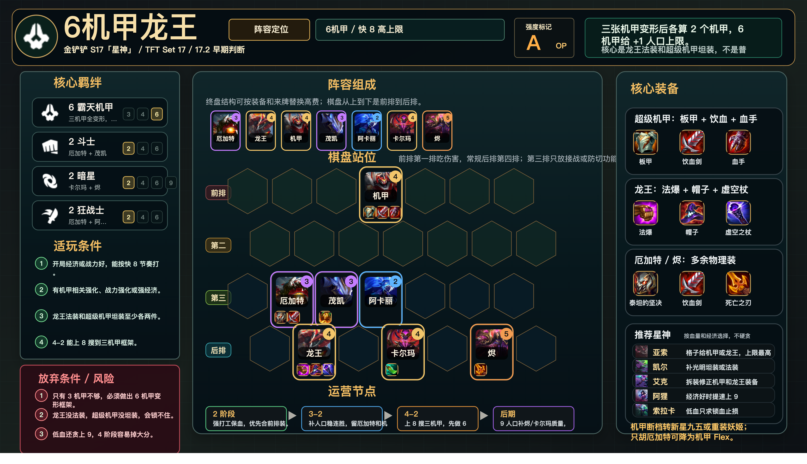

# 6机甲龙王

适用版本：金铲铲 S17「星神」/ TFT Set 17 / 17.2 早期判断
阵容定位：6 机甲快 8，高上限运营。



## 数据摘要

当前按 17.2 早期版本判断。正确分支是 6 霸天机甲：三张机甲单位变形后各算 2 个机甲，并且 6 机甲给 +1 人口上限。上一版写成 3 机甲高费拼，已经降权为错误分支。

## 阵容组成

9 人口：厄加特、奥瑞利安·索尔、超级机甲、茂凯、阿卡丽、卡尔玛、烬。

核心羁绊：6 霸天机甲、2 斗士、2 暗星、2 狂战士。

注：棋盘上看起来只有 7 个单位，是因为厄加特、奥瑞利安·索尔、超级机甲变形后各占 2 个队伍格子并各计 2 个机甲。

```text
前排 | . . . 超级机甲 . . .
第二 | . . . . . . .
第三 | . 厄加特 茂凯 阿卡丽 . . .
后排 | . 奥瑞利安·索尔 . 卡尔玛 . 烬 .
```

## 适玩条件

- 开局经济或战力好，能按快 8 节奏打。
- 有机甲相关强化、战力强化或强经济。
- 龙王法装和超级机甲坦装至少各两件。
- 4-2 能上 8 搜到三机甲框架。

## 放弃条件

- 只有 3 机甲，补不出 6 机甲框架。
- 龙王没法装，超级机甲没坦装。
- 低血还贪上 9，4 阶段容易掉大分。
- 4-2 搜不到三机甲主框架，应该转新星九五或重装妖姬。

## 装备

- 超级机甲：石像鬼石板甲、饮血剑、斯特拉克的挑战护手。
- 奥瑞利安·索尔：珠光护手、灭世者的死亡之帽、虚空之杖。
- 厄加特 / 烬：泰坦的坚决、饮血剑、死亡之刃等多余物理装。

## 运营节奏

- 2 阶段：强打工保血，优先合前排装。
- 3-2：补人口稳连胜，留厄加特和机甲牌。
- 4-2：上 8 搜三机甲，先做 6 机甲框架。
- 后期：9 人口补烬、卡尔玛质量，找龙王二星。

## 星神选择

- 亚索：格子给机甲或龙王，上限最高。
- 凯尔：补光明坦装或法装。
- 艾克：拆装修正机甲和龙王装备。
- 阿狸：经济好时提速上 9。
- 索拉卡：低血只求锁血止损。

## 注意事项

- 超级机甲单顶中间，厄加特和茂凯第三排接战。
- 龙王后排左侧或中间安全位，烬和卡尔玛分散。
- 只有 3 机甲时不要当 OP 线打，要么补 6 要么转。
