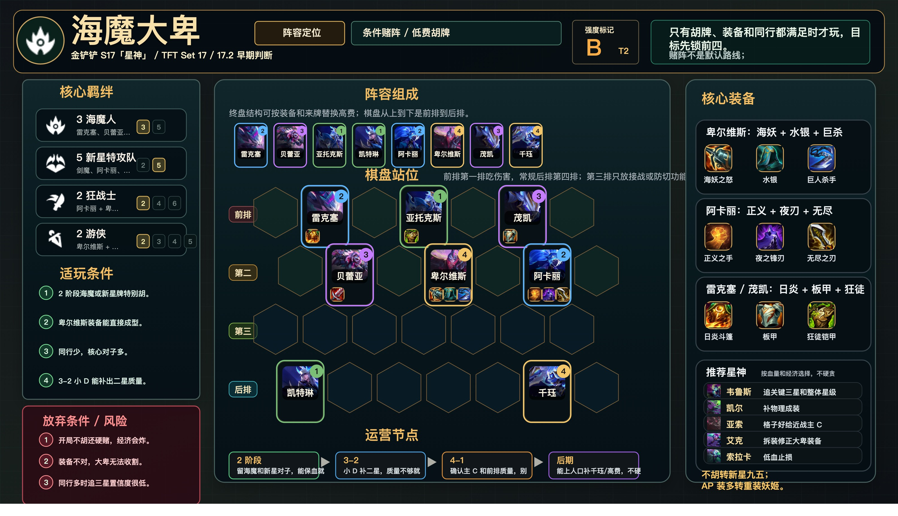

# 海魔大卑

适用版本：金铲铲 S17「星神」/ TFT Set 17 / 17.2 早期判断
阵容定位：条件赌阵，T2 胡牌阵容。



## 阵容组成

8 人口：雷克塞、贝蕾亚、亚托克斯、凯特琳、阿卡丽、卑尔维斯、茂凯、千珏。

核心羁绊：海魔人、新星特攻队、狂战士、游侠。

```text
前排 | . 雷克塞 . 亚托克斯 . 茂凯 .
第二 | . 贝蕾亚 . 卑尔维斯 . 阿卡丽 .
第三 | . . . . . . .
后排 | 凯特琳 . . . . 千珏 .
```

## 适玩条件

- 2 阶段海魔或新星牌特别胡。
- 卑尔维斯装备能直接成型。
- 同行少，核心对子多。
- 3-2 小 D 能补出二星质量。

## 放弃条件

- 开局不胡还硬赌，经济会炸。
- 装备不对，卑尔维斯无法收割。
- 同行多时追三星置信度很低。

## 装备

- 卑尔维斯：海妖之怒、水银、巨人杀手。
- 阿卡丽：正义之手、夜之锋刃、无尽之刃。
- 雷克塞 / 茂凯：日炎斗篷、石像鬼石板甲、狂徒铠甲。

## 运营节奏

- 2 阶段：留海魔和新星对子，能保血就保血。
- 3-2：小 D 补二星，质量不够就转阵。
- 4-1：确认主 C 和前排质量，别盲目 D 光。
- 后期：能上人口补千珏 / 高费，不硬追三星。

## 注意事项

- 近战主 C 第二排接战，不要第一排被秒。
- 阿卡丽和卑尔维斯分侧，避免同吃控制。
- 胡牌才玩，普通局优先运营阵容。
