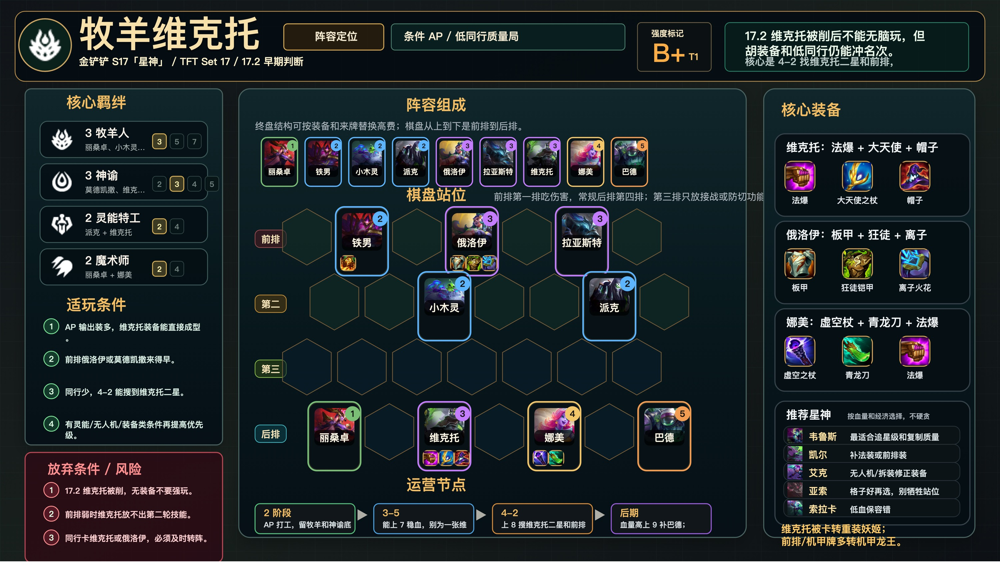

# 牧羊维克托

适用版本：金铲铲 S17「星神」/ TFT Set 17 / 17.2 早期判断
阵容定位：条件 AP，低同行质量局。



## 数据摘要

17.2 维克托被削弱，所以这套不能无脑强玩。只有在 AP 装、前排、同行和星神条件都合适时，才作为 T1 条件阵容进入比赛池。

## 阵容组成

9 人口：丽桑卓、莫德凯撒、小木灵、派克、俄洛伊、拉亚斯特、维克托、娜美、巴德。

核心羁绊：3 牧羊人、3 神谕、2 灵能特工、2 魔术师、2 重装战士。

```text
前排 | . 莫德凯撒 小木灵 俄洛伊 . 拉亚斯特 .
第二 | . . . . . 派克 .
第三 | . . . . . . .
后排 | 丽桑卓 . 维克托 . 娜美 . 巴德
```

## 适玩条件

- AP 输出装多，维克托装备能直接成型。
- 前排俄洛伊或莫德凯撒来得早。
- 同行少，4-2 能搜到维克托二星。
- 有灵能、无人机或装备类条件再提高优先级。

## 放弃条件

- 无维克托、无 AP 输出装。
- 前排弱，维克托放不出第二轮技能。
- 同行卡维克托或俄洛伊。
- 4-2 低血大搜后仍锁不住。

## 装备

- 维克托：珠光护手、大天使之杖、灭世者的死亡之帽。
- 俄洛伊：石像鬼石板甲、狂徒铠甲、离子火花。
- 娜美：虚空之杖、朔极之矛、珠光护手。

## 运营节奏

- 2 阶段：AP 打工，留牧羊和神谕底座。
- 3-5：能上 7 稳血，别为一张维克托乱搜。
- 4-2：上 8 搜维克托二星和前排质量。
- 后期：血量高上 9 补巴德；低血在 8 级补二星。

## 星神选择

- 韦鲁斯：最适合追星级和复制质量。
- 凯尔：补法装或前排装。
- 艾克：无人机、拆装，修正装备。
- 亚索：格子好再选，别牺牲站位。
- 索拉卡：低血保容错。

## 注意事项

- 维克托站后排中间，技能覆盖更多目标。
- 娜美与维克托分侧，防同吃控制。
- 没有低同行和 AP 装时，转重装妖姬更稳。
