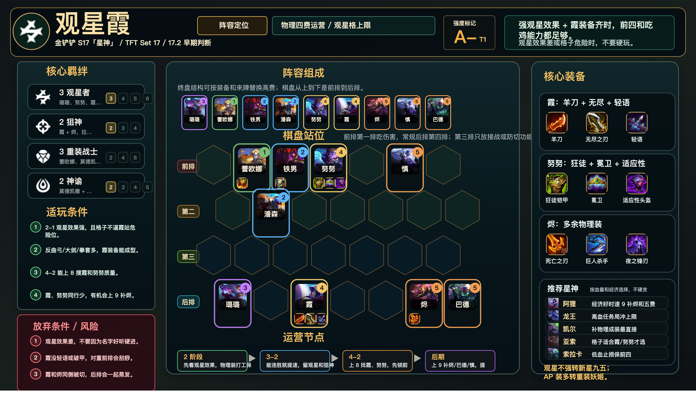

# 观星霞

适用版本：金铲铲 S17「星神」/ TFT Set 17 / 17.2 早期判断
阵容定位：物理四费运营，观星格上限阵容。



## 数据摘要

霞在 17.2 有小幅削弱，但强观星效果和装备正确时仍有争冠能力。观星效果差、格子危险或无破甲装时不强玩。

## 阵容组成

9 人口：璐璐、蕾欧娜、莫德凯撒、潘森、努努和威朗普、霞、烬、慎、巴德。

核心羁绊：3 观星者、2 狙神、重装前排、神谕功能。

```text
前排 | . 蕾欧娜 莫德凯撒 努努 . 慎 .
第二 | . 潘森 . . . . .
第三 | . . . . . . .
后排 | 璐璐 . 霞 . . 烬 巴德
```

## 适玩条件

- 2-1 观星效果强，且格子不逼霞站危险位。
- 反曲弓、大剑、拳套多，霞装备能成型。
- 4-2 能上 8 搜霞和努努质量。
- 霞、努努同行少，有机会上 9 补烬。

## 放弃条件

- 观星效果差。
- 霞没轻语或破甲，对重前排会刮痧。
- 霞和烬同侧被切，后排会一起蒸发。
- 4 阶段血量低且搜不到霞、努努质量。

## 装备

- 霞：鬼索的狂暴之刃、无尽之刃、最后的轻语。
- 努努：狂徒铠甲、冕卫、适应性头盔。
- 烬：死亡之刃、巨人杀手、夜之锋刃等多余物理装。

## 运营节奏

- 2 阶段：先看观星效果，物理装打工保血。
- 3-2：能连胜就提速，留观星和狙神牌。
- 4-2：上 8 找霞、努努，先锁前四。
- 后期：上 9 补烬、巴德、慎，提高终盘控制。

## 星神选择

- 阿狸：经济好时速 9 补烬和五费。
- 奥瑞利安·索尔：高血任务局冲上限。
- 凯尔：补物理成装最直接。
- 亚索：格子适合霞或努努才选。
- 索拉卡：低血止损保前四。

## 注意事项

- 霞后排安全位拉满狙神距离，不固定角落。
- 努努对主 C 侧顶住，烬与霞分角。
- 观星格危险时宁可少吃收益也要保主 C。
