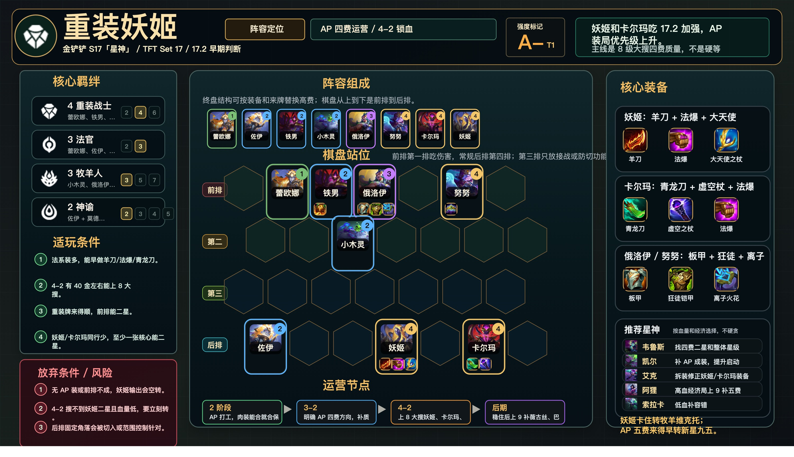

# 重装妖姬

适用版本：金铲铲 S17「星神」/ TFT Set 17 / 17.2 早期判断
阵容定位：AP 四费运营，4-2 锁血阵容。



## 数据摘要

17.2 中乐芙兰和卡尔玛增强，AP 四费运营优先级上升。当前仍需要三站数据复核，不编造平均排名、前四率和登顶率。

## 阵容组成

8 人口：蕾欧娜、佐伊、莫德凯撒、小木灵、俄洛伊、努努和威朗普、卡尔玛、乐芙兰。
9 人口：补薇古丝、巴德、慎或其他高费控制。

核心羁绊：4 重装战士、3 法官、3 牧羊人、2 神谕。

```text
前排 | . 蕾欧娜 莫德凯撒 俄洛伊 小木灵 努努 .
第二 | . . . . . . .
第三 | . . . . . . .
后排 | 佐伊 . . 乐芙兰 . 卡尔玛 .
```

## 适玩条件

- 法系装多，能早做羊刀、法爆或青龙刀。
- 4-2 有足够金币上 8 大搜。
- 重装牌来得顺，前排能二星。
- 乐芙兰和卡尔玛同行少。

## 放弃条件

- 无 AP 装或前排不成。
- 4-2 搜不到乐芙兰二星且血量低。
- 乐芙兰、卡尔玛被多人卡。
- 后排站位被切入或范围控制针对。

## 装备

- 乐芙兰：鬼索的狂暴之刃、珠光护手、大天使之杖。
- 卡尔玛：朔极之矛、虚空之杖、珠光护手。
- 俄洛伊 / 努努：石像鬼石板甲、狂徒铠甲、离子火花。

## 运营节奏

- 2 阶段：AP 打工，肉装能合就合保血。
- 3-2：明确 AP 四费方向，补质量别掉太多血。
- 4-2：上 8 大搜乐芙兰、卡尔玛、重装前排。
- 后期：稳住后上 9 补薇古丝、巴德或控制。

## 星神选择

- 韦鲁斯：找四费二星和整体星级。
- 凯尔：补 AP 成装，提升启动。
- 艾克：拆装修正乐芙兰和卡尔玛装备。
- 阿狸：高血经济局上 9 补五费。
- 索拉卡：低血补容错。

## 注意事项

- 乐芙兰不要死站角落，避开对手切入侧。
- 卡尔玛和乐芙兰分散，防同吃范围伤害。
- 锁血后再补上限，不要在 8 级 D 到 0 追三星。
